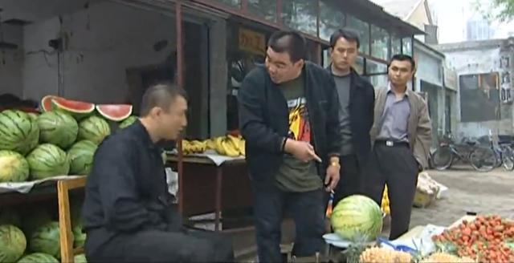

# 华强买瓜

#### 注意：在练习过程中，请勿切分支和看提交记录。不要作弊哈~

## 流程

### 主流程设定

和B站最近比较火的《华强买瓜》的流程类似，但进行了一些修改
1. 华强从老板的水果摊选西瓜，并且看样子长得比较熟才打算买
2. 华强问价格，老板报价后虽然骂骂咧咧但还是买了
3. 老板称完瓜，得到总价格。华强认可价格，交钱买瓜
4. 买瓜后，华强发现西瓜实际上并不熟，于是找茬，向老板开枪（这里改了下）

#### 以下设定是为了增加业务的复杂度

### 水果的设定
1. 老板卖3种水果：苹果、香蕉和西瓜
2. 华强要买的是西瓜

### 水果成熟度设定
1. 成熟度由"颜色成熟度"和"糖分成熟度"2个部分算得
2. 交钱之后才能算最终成熟度

### 价格设定

1. 单价会根据瓜的颜色成熟度有一定折扣

### 子弹设定
1. 子弹由子弹头和子弹体组合而成，2者需满足一定条件，否则会导致炸膛
2. 子弹射击前需要预热，根据版本不同，有2种预热方式
3. 子弹使用完前会调销毁回调，但区分是否引起炸膛2种情况
